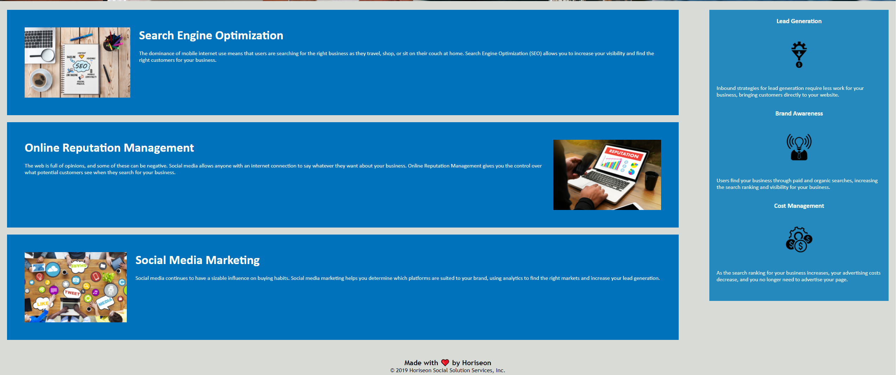

# Refactor-Landing-Page
Link to website https://bppearsall.github.io/Refactor-Landing-Page/#search-engine-optimization

Horiseon requested update to HTML and CSS files to fix usability and eliminate
redundancies

Steps Taken:

-All navigation links were checked and verified in order to ensure usability,
search engine optimization required fixing

-Changed HTML elements to be more intuitive to the display. Replaced divs with
main, aside, section, etc.

-Changed HTML classes to be more intuitive to what is described

-Changed CSS document order to be more in line with HTML and website presentation
along with ensuring that updated HTML classes were identical to CSS classes

-All images were given alt attributes to consicely describe what the image is
to those with disabilities

-Updates website title to be more descriptive and unique to Horiseon

-Website looks like requested mockup and has ensured full user functionality

